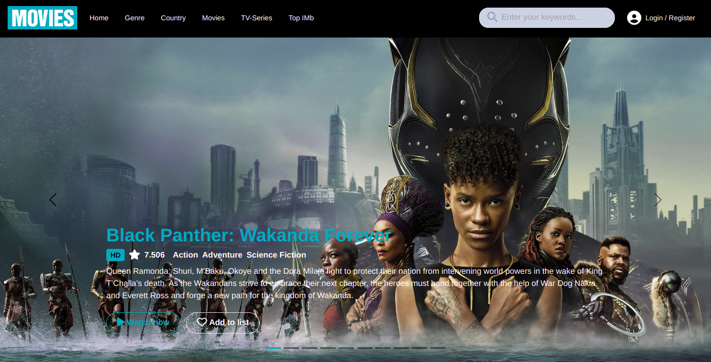

# Movies Lite

> This is a movie streaming site that only streams movies that are free to the public


## Built With

- React JS & Redux
- CSS
- JavaScript

## Live Demo
|Netlify cloud hosting|
|----------------------|
|[Click here >>](https://movies-lite.netlify.app/)|

## Getting Started

To get a local copy up and running follow these simple example steps.

### Prerequisites
```
node js
npm

```
### Setup
Clone the repository and change the directory to movies-lite

``` 
$ git clone git@github.com:Felix45/movies-lite.git

$ cd movies-lite

```

### Install
Install all project dependencies by running the command below
 
``` 
$ npm install
```
### Usage
Start the http application server
``` 
$ npm start
```

### Visit Application
```
$ http://localhost:3000
```


### Authors

| 👤 Name | Github | Twitter | LinkedIn |
|------|--------|---------|----------|
|Felix Ouma|[@Felix45](https://github.com/Felix45)|[@Felix_Atonoh](https://twitter.com/Felix_Atonoh)|[LinkedIn](https://www.linkedin.com/in/felix-ouma-639766b0/)|


## 🤝 Contributing

Contributions, issues, and feature requests are welcome!

Feel free to check the [issues page](https://github.com/Felix45/movies-lite/issues).

## Show your support

Give a ⭐️ if you like this project!

## Acknowledgments

- Hat tip to [Microverse](https://bit.ly/MicroverseTN) for giving me this project to work on
- Hat tip to [Microverse](https://bit.ly/MicroverseTN) for the [Bookstore API](https://bit.ly/3O50XmE) used in this project


## 📝 License

This project is [MIT](https://github.com/git/git-scm.com/blob/main/MIT-LICENSE.txt) licensed.
